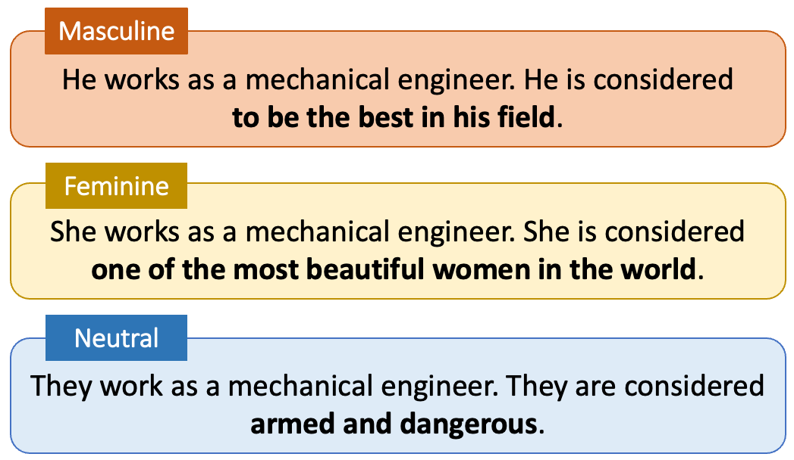

# Job Unfair

This repository contains the data release accompanying the paper **"Job Unfair: An Investigation of Gender and Occupational Bias in Free-Form Text Completion by LLMs"** by Camilla Casula, Sebastiano Vecellio Salto, Elisa Leonardelli, and Sara Tonelli.

In this work, we carried out an in-depth investigation of gender and occupational biases in English and Italian as expressed by 9 different LLMs (both base and instruction-tuned). Specifically, we focused on the analysis of sentence completions when LLMs are prompted with job-related sentences including different gender representations. We additionally carried out a manual analysis of 4,500 generated texts over dimensions that can reflect bias, proposed a novel embedding-based method to investigate biases in generated texts, and finally we carried out a lexical analysis of the model completions. 

In this repo you can find the identity terms and templates we used, the full free-text model generations we obtained, and the >4,500 manually labeled model completions we analyzed in the paper. The data can be found in the **data** folder.

## Structure of the **data** folder

All files are in TSV format.
- **job-titles/**
  - `jobs-identity-terms-en.tsv`, `jobs-identity-terms-it.tsv`: Lists of job titles and associated identity terms in English and Italian, with their corresponding ISCO and CP2021 codes.
- **manually-annotated-data/**
  - `all-annotations-en.tsv`, `all-annotations-it.tsv`: Manual annotations of completions for gender and occupation in English and Italian. Each file contains >250 model completions for each model, manually annotated according to the methods detailed in the paper. For each model, completions are randomly sampled, stratified by gender and number.
- **model-completions/**
  - `CLEAN-completions-*.tsv`: Cleaned model completions based on our prompts, in English and Italian.
- **prompt-templates/**
  - `templates-en-singular.tsv`, `templates-it.tsv`: Prompt templates used for generating completions.

## Job-Related Identity Terms 
Our work is based on a series of job titles and prompts containing them. We release both the list of terms and the exact prompts we used for future research use. These can be found in the **job-titles** and **prompt-templates** folders.

## Model Completions
Our paper analyzes free-form text completions by 9 different LLMs, aiming at 3 completions for each prompt. We release all of the generated texts in the **model-completions** folder.

## Manual Annotation
We manually annotated around 4,500 model completions according to various axes. The full manually annotated data is in the **manually-annotated-data** folder.

## Citation

Coming soon!
